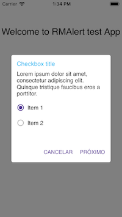

# RMPopup

<a href="#appearance">Appearance</a> &bull;
<a href="#motivation">Motivation</a> &bull;

-------

## Appearance

<h3 align="center">

</h3>

## Motivation

A Custom alert popup component in Swift 3.
